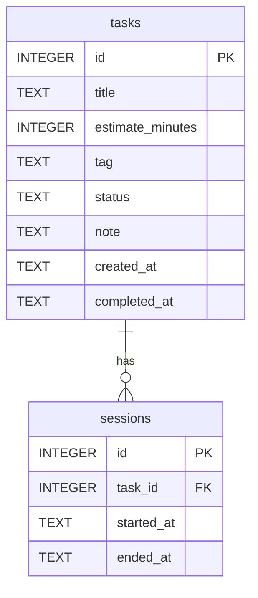

# 機能設計書

## システム構成図

```
┌─────────────────────────────────────────┐
│  ユーザー（VSCode ターミナル / WSL2）    │
└───────────────┬─────────────────────────┘
                │ todo <command>
                ▼
┌─────────────────────────────────────────┐
│  CLI エントリーポイント (bin/todo.js)   │
│  - 引数パース                           │
│  - コマンドルーティング                 │
│  - 未クローズセッション検出             │
└───────────────┬─────────────────────────┘
                │
        ┌───────┴────────┐
        ▼                ▼
┌──────────────┐  ┌──────────────────────┐
│  コマンド    │  │  自動バックアップ     │
│  ハンドラー  │  │  (初回起動時チェック) │
│  commands/   │  └──────────────────────┘
└──────┬───────┘
       │
   ┌───┴──────────────────────┐
   ▼          ▼               ▼
┌──────┐ ┌────────┐ ┌──────────────┐
│タスク│ │タイマー│ │  統計        │
│サービ│ │サービス│ │  サービス    │
│ス   │ │timer.js│ │  stats.js    │
└──┬───┘ └───┬────┘ └──────┬───────┘
   │         │              │
   └────────┬┘              │
            ▼               ▼
┌───────────────────────────────────────┐
│  データベース層 (db/database.js)       │
│  SQLite  ~/.todo/tasks.db             │
└───────────────────────────────────────┘
```

---

## データモデル定義

### ER図



### tasks テーブル

| カラム           | 型      | 制約                      | 説明                                               |
|------------------|---------|---------------------------|----------------------------------------------------|
| id               | INTEGER | PRIMARY KEY AUTOINCREMENT | タスクID（削除後は欠番になる。再利用・振り直しはしない） |
| title            | TEXT    | NOT NULL                  | タスクタイトル                                     |
| estimate_minutes | INTEGER | NOT NULL                  | 見積もり時間（分）。1以上の整数                    |
| tag              | TEXT    |                           | タグ（例: feature, bug, refactor）                 |
| status           | TEXT    | NOT NULL DEFAULT 'pending'| 状態                                               |
| note             | TEXT    |                           | 完了時メモ                                         |
| created_at       | TEXT    | NOT NULL                  | 作成日時（ISO8601 JST）                            |
| completed_at     | TEXT    |                           | 完了日時（ISO8601 JST）                            |

**status の値**:
- `pending` — 未着手
- `in_progress` — 作業中
- `paused` — 一時停止
- `done` — 完了

### sessions テーブル

| カラム     | 型      | 制約                      | 説明                          |
|------------|---------|---------------------------|-------------------------------|
| id         | INTEGER | PRIMARY KEY AUTOINCREMENT | セッションID                  |
| task_id    | INTEGER | NOT NULL, FK → tasks.id   | 対象タスク                    |
| started_at | TEXT    | NOT NULL                  | 作業開始日時（ISO8601 JST）   |
| ended_at   | TEXT    |                           | 作業終了日時（null = 作業中） |

**実績時間の計算**:
```
実績時間(分) = Σ (ended_at - started_at) for all sessions where task_id = ? AND ended_at IS NOT NULL
```

---

## クラッシュ・異常終了時の対処

アプリ起動時（任意のコマンド実行時）に `ended_at = NULL` のセッションが存在する場合、前回の異常終了と判断し以下の処理を行う。

ID・タスク名・開始時刻は実際の値が入る。
```
⚠ 前回の作業セッションが正常に終了していません。
  タスク #5 "認証機能の実装" (開始: 2026-03-19 10:30)

どうしますか？
  [1] 今の時刻で作業終了として記録する
  [2] このセッションを破棄する（実績に含めない）
  [3] 作業時間を手動で入力する（例: 1h, 1h30m, 45m）
  選択 [1/2/3]:
```

- `[3]` を選択した場合、時間入力プロンプトを表示:
  ```
  作業時間を入力してください (例: 1h, 1h30m, 45m):
  ```
  入力値を分に変換し、`ended_at = started_at + 入力時間` として記録する
- いずれを選んでも以降のコマンドは正常に動作する
- 選択後、該当セッションの `ended_at` を更新または削除する

---

## コンポーネント設計

### ディレクトリ構成

```
cli-todo/
├── bin/
│   └── todo.js          # CLIエントリーポイント
├── src/
│   ├── commands/        # コマンドハンドラー
│   │   ├── add.js
│   │   ├── list.js
│   │   ├── edit.js
│   │   ├── start.js
│   │   ├── pause.js
│   │   ├── done.js
│   │   ├── stats.js
│   │   ├── show.js
│   │   ├── delete.js
│   │   ├── backup.js    # todo backup list
│   │   └── restore.js
│   ├── services/        # ビジネスロジック
│   │   ├── timer.js     # タイマー・実績時間計算
│   │   ├── stats.js     # 統計・乖離率計算
│   │   ├── similarity.js # 類似タスク検索
│   │   └── autoBackup.js # 自動バックアップ
│   ├── db/
│   │   ├── database.js  # DB接続・初期化
│   │   └── schema.sql   # テーブル定義
│   └── utils/
│       ├── time.js      # 時間フォーマット（分 ↔ "2h30m"）
│       ├── prompt.js    # 確認プロンプト
│       └── color.js     # カラー出力（TTY環境のみ有効）
├── package.json
└── README.md
```

### カラー出力方針

- `process.stdout.isTTY === true` の場合のみカラー表示を有効にする
- パイプやリダイレクト時は自動的に色なしになる

| 用途                 | 色         |
|----------------------|------------|
| 成功メッセージ       | 緑         |
| エラーメッセージ     | 赤         |
| 警告・確認プロンプト | 黄         |
| 通常出力             | デフォルト |

---

## コマンド詳細設計

### `todo add`

```
todo add <title> --estimate <time> [--tag <tag>]
```

**処理フロー**:
1. `--estimate` を分に変換（例: `2h` → 120, `30m` → 30, `1h30m` → 90）
2. バリデーション（見積もりが1分以上か）
3. 類似タスクを検索する
4. 類似タスクが存在する場合、実績を表示し見積もりの確認プロンプトを表示（ID・タスク名・実績時間・タグ・見積もり時間は実際の値が入る）:
   ```
   📊 類似タスクの実績:
     #2 "ログイン画面の実装"  実績3h20m  [feature]
     #1 "会員登録機能"        実績4h10m  [feature]

   見積もり 2h でよいですか？ [Y/n/変更]:
   ```
   - `Y` または Enter → そのまま保存
   - `n` → キャンセル（タスクは追加しない）
   - 時間を入力（例: `3h`）→ 見積もりを変更して保存
5. タスクをDBに保存（status: pending）
6. 保存完了を表示

**見積もり時間フォーマット**:
- `2h` → 120分
- `30m` → 30分
- `1h30m` → 90分
- `90` → 90分（単位なしは分として扱う）
- `0` や負の値 → エラー: `エラー: 見積もり時間は1分以上で入力してください`

**出力例（類似タスクあり・見積もり変更した場合）**（ID・タスク名・実績時間・タグ・見積もり時間は実際の値が入る）:
```
📊 類似タスクの実績:
  #2 "ログイン画面の実装"  実績3h20m  [feature]
  #1 "会員登録機能"        実績4h10m  [feature]

見積もり 2h でよいですか？ [Y/n/変更]: 3h

✓ タスク追加: "認証機能の実装" (見積もり: 3h, タグ: feature) [ID: 5]
```

**出力例（類似タスクなし）**（タスク名・見積もり時間・タグ・IDは実際の値が入る）:
```
✓ タスク追加: "認証機能の実装" (見積もり: 2h, タグ: feature) [ID: 5]
```

---

### `todo list`

```
todo list [--status <status>] [--all]
```

**デフォルト表示**: `pending` / `in_progress` / `paused` のみ表示（完了済みは非表示）

**オプション**:
- `--status <status>`: 指定したステータスのみ表示（`pending` / `in_progress` / `paused` / `done`）
- `--all`: 完了済みを含む全タスクを表示

**出力例**（ID・タスク名・見積もり時間・状態・タグは実際の値が入る）:
```
ID   タイトル                  見積もり  状態          タグ
─────────────────────────────────────────────────────────
  5  認証機能の実装            2h        ⏸ 停止中      feature
  4  バグ修正: ログインエラー  30m       ○ 未着手      bug

完了済みを表示するには: todo list --status done
```

---

### `todo show`

```
todo show <id>
```

**出力内容**: タスクの詳細情報＋セッション履歴

**出力例**（ID・タスク名・状態・タグ・見積もり・実績時間・日時・セッション履歴は実際の値が入る）:
```
─────────────────────────────────────
タスク #5: 認証機能の実装
─────────────────────────────────────
状態:       ⏸ 一時停止中
タグ:       feature
見積もり:   2h
実績時間:   1h20m（現在まで）
作成日時:   2026-03-19 09:00
完了時メモ: -

【作業セッション】
  1回目: 10:00 〜 11:00  (1h)
  2回目: 13:00 〜 13:20  (20m)
  合計: 1h20m
```

---

### `todo edit`

```
todo edit <id> [--title <title>] [--estimate <time>] [--tag <tag>]
```

**編集可否**:

| status      | title | estimate | tag |
|-------------|-------|----------|-----|
| pending     | ○     | ○        | ○   |
| in_progress | ○     | ×        | ○   |
| paused      | ○     | ○        | ○   |
| done        | ×     | ×        | ×   |

- `in_progress` 中に `--estimate` を指定した場合: `エラー: 作業中のタスクの見積もりは変更できません。一時停止してから編集してください`
- `done` のタスクを編集しようとした場合: `エラー: 完了済みのタスクは編集できません`

**出力例**（ID・タスク名・更新内容は実際の値が入る）:
```
✓ タスク #5 を更新しました: "認証機能の実装" (見積もり: 3h)
```

---

### `todo delete`

```
todo delete <id>
```

**削除可否**:
- `in_progress` のタスクは削除不可: `エラー: 作業中のタスクは削除できません。先に todo pause または todo done を実行してください`
- それ以外は確認プロンプトを表示（ID・タスク名は実際の値が入る）:
  ```
  タスク #4 "バグ修正: ログインエラー" を削除しますか？ [y/N]:
  ```
- 削除するとIDは欠番になる（振り直しはしない）

---

### `todo start`

```
todo start <id>
```

**処理フロー**:
1. バリデーション（エラー条件を参照）
2. sessionsテーブルに新しいセッションを作成（`started_at` = 現在時刻）
3. タスクの status を `in_progress` に更新
4. 開始メッセージを表示（タスク名・見積もり時間は実際の値が入る）:
   ```
   ▶ 開始: "認証機能の実装" (見積もり: 2h)
   ```

**エラー条件**:

| 条件             | エラーメッセージ                                                              |
|------------------|-------------------------------------------------------------------------------|
| 存在しないID     | `エラー: タスクID <入力値> は存在しません`（例: `エラー: タスクID 99 は存在しません`） |
| 見積もりなし     | `エラー: 見積もりを設定してから開始してください (todo edit 5 --estimate 2h)`  |
| すでに作業中     | `エラー: すでにタスク "#<ID> <タスク名>" が作業中です`（例: `エラー: すでにタスク "#5 認証機能の実装" が作業中です`） |
| 完了済み         | `エラー: 完了済みのタスクは開始できません`                                    |

---

### `todo pause`

**エラー条件**:

| 条件               | エラーメッセージ                         |
|--------------------|------------------------------------------|
| 作業中タスクがない | `エラー: 現在作業中のタスクがありません` |

**処理フロー**:
1. 作業中セッションの `ended_at` を記録
2. タスクの status を `paused` に更新
3. 経過時間を表示（タスク名・今回の時間・累計時間は実際の値が入る）:
   ```
   ⏸ 一時停止: "認証機能の実装" (今回: 1h, 累計: 1h)
   ```

---

### `todo done`

```
todo done [--note <text>]
```

**エラー条件**:

| 条件                               | エラーメッセージ                         |
|------------------------------------|------------------------------------------|
| 作業中・一時停止中のタスクがない   | `エラー: 完了できるタスクがありません`   |

**処理フロー**:
1. 一時停止中の場合、確認プロンプトを表示（「認証機能の実装」の部分は実際のタスク名が入る）:
   ```
   ⚠ タスク「認証機能の実装」は一時停止中です。完了にしますか？ [y/N]:
   ```
2. 作業中セッションの `ended_at` を記録
3. タスクの status を `done`、`completed_at` を記録
4. `--note` が指定されている場合、`note` をDBに保存する
5. 乖離率を表示（タスク名・見積もり時間・実績時間・乖離率は実際の値が入る）:
   ```
   ✓ 完了: "認証機能の実装"
     見積もり: 2h  実績: 3h20m  乖離率: +67%
   ```

---

### `todo stats`

```
todo stats [--tag <tag>] [--period <days>]
```

**`--period <days>`**: 直近N日間に完了したタスクのみを対象に統計を表示する
- 例: `todo stats --period 30` → 直近30日間のタスクで集計

**出力例**（5タスク以上蓄積後。乖離率・件数・タグ名は実際の値が入る）:
```
═══════════════════════════════════════════
  見積もり精度レポート
═══════════════════════════════════════════

【全タスク平均】
  乖離率 +85%（見積もりより平均85%多くかかっている）  全20件

【タグ別】
  feature:  乖離率 +120%  (5件)
  bug:      乖離率 +15%   (8件)  ← 得意
  docs:     乖離率 -10%   (3件)  ← 見積もりより早い

【改善トレンド（期間別平均乖離率）】
  直近3ヶ月:  +85%   (8件)
  直近半年:   +105%  (14件)
  直近1年:    +120%  (18件)
  全期間:     +130%  (20件)
  → 時間とともに精度が改善しています 📈

（データ蓄積が3件未満の期間は表示されません）
```

---

### `todo backup list`

```
todo backup list
```

**出力例**（ファイル名・サイズ・日付・件数は実際の値が入る）:
```
バックアップ一覧 (~/.todo/backups/)  ※ tasks.db.bak は含まない
────────────────────────────────────────
  tasks-2026-03-19.db  124KB  2026-03-19  ← 本日
  tasks-2026-03-18.db  121KB  2026-03-18
  tasks-2026-03-17.db  118KB  2026-03-17

合計 <件数>件 / 最大30件保持
```

バックアップが存在しない場合:
```
バックアップはまだありません。
```

---

### `todo restore`

```
todo restore <file>
```

**処理フロー**:
1. 指定ファイルが存在するかチェック（存在しない場合エラー）
2. 指定ファイルが有効なSQLiteファイルかチェック（壊れている場合エラー: `エラー: 指定されたファイルは有効なバックアップではありません`）
3. 確認プロンプトを表示（ファイル名は実際の値が入る）:
   ```
   現在のデータを tasks-2026-03-01.db の内容で上書きします。よいですか？ [y/N]:
   ```
4. 現在の `tasks.db` を `tasks.db.bak` にリネーム
5. 指定ファイルを `tasks.db` としてコピー
6. 成功メッセージを表示（ファイル名は実際の値が入る）:
   ```
   ✓ 復元完了: tasks-2026-03-01.db から復元しました
     元のデータは tasks.db.bak に保存されています
   ```

---

## 類似タスク提案ロジック

### 判定アルゴリズム

優先度順に以下を適用し、上位3件を表示する。

```
1. タグ完全一致
   - 同じタグを持つ完了済みタスクを候補とする

2. タイトル単語一致
   - タイトルをスペース区切りで単語に分割
   - 1文字・助詞・一般的すぎる語（「の」「を」「する」「について」等）を除外
   - 共通単語が1つ以上あれば候補とする

3. スコアリング
   - タグ一致: +2点
   - 単語一致（1語ごと）: +1点
   - 降順ソートし上位3件を返す
   - 同スコアの場合は完了日が新しい順
```

### 表示条件

- 完了済みタスクのみ対象（実績時間が確定しているもの）
- 候補が0件の場合は表示しない
- 候補が1〜3件の場合はその件数だけ表示

---

## 乖離率計算仕様

```
乖離率(%) = (実績時間 - 見積もり時間) / 見積もり時間 × 100

例:
  見積もり 60分, 実績 100分 → +67%（67%多くかかった）
  見積もり 60分, 実績 50分  → -17%（17%早く終わった）
```

### 改善トレンドの計算基準

```
各期間の平均乖離率 = 「その期間内（直近N日間）に完了したタスク」の乖離率の平均

例:
  直近3ヶ月  = 完了日が過去90日以内のタスクの平均乖離率
  直近半年   = 完了日が過去180日以内のタスクの平均乖離率
  直近1年    = 完了日が過去365日以内のタスクの平均乖離率
  全期間     = 全完了タスクの平均乖離率

→ 直近3ヶ月の値が全期間より低ければ「改善中」と判定
```

**表示条件（各期間）**:
- 全期間: 完了タスク5件以上
- 直近3ヶ月・半年・1年: 対象期間内の完了タスク3件以上

---

## 自動バックアップ設計

### 実行タイミング
- 任意のコマンド実行時、当日のバックアップファイルが存在しない場合に実行
- バックアップはメインの処理と非同期で行い、コマンドの応答速度に影響させない
- バックアップ中にエラーが発生した場合は警告を表示するが、コマンド自体は正常終了させる

### ファイル管理方針

| ファイル                              | 用途                      | `backup list` 表示 | 自動削除                       |
|---------------------------------------|---------------------------|--------------------|--------------------------------|
| `~/.todo/backups/tasks-YYYY-MM-DD.db` | 日次自動バックアップ      | ○                  | 30日経過後に削除               |
| `~/.todo/tasks.db.bak`                | restore直前の退避ファイル | ×                  | しない（次回restoreで上書き）  |

### ローテーション
- バックアップ作成後、30日以上前の `tasks-YYYY-MM-DD.db` を自動削除
- `tasks.db.bak` はローテーション対象外

詳細は「コマンド詳細設計」の `todo backup list` / `todo restore` を参照。
